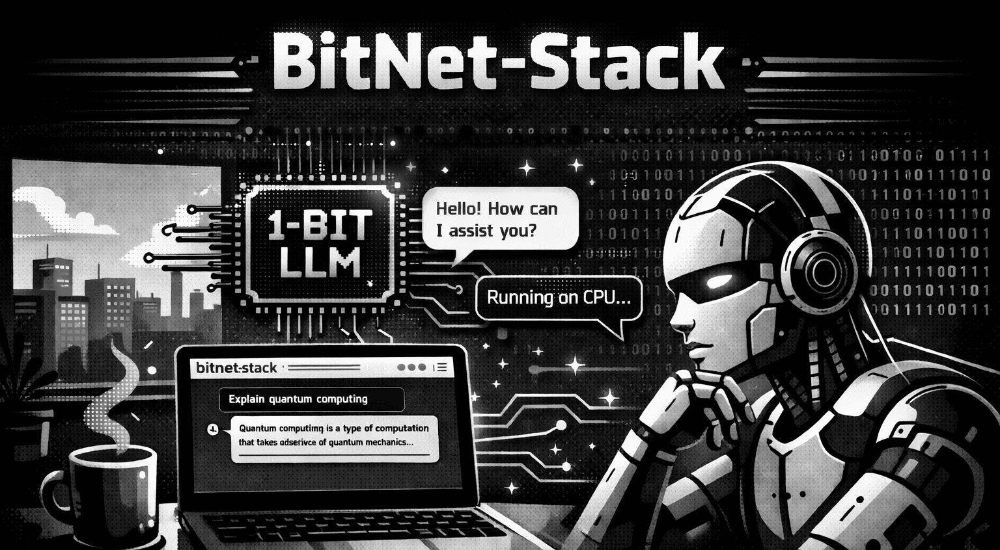
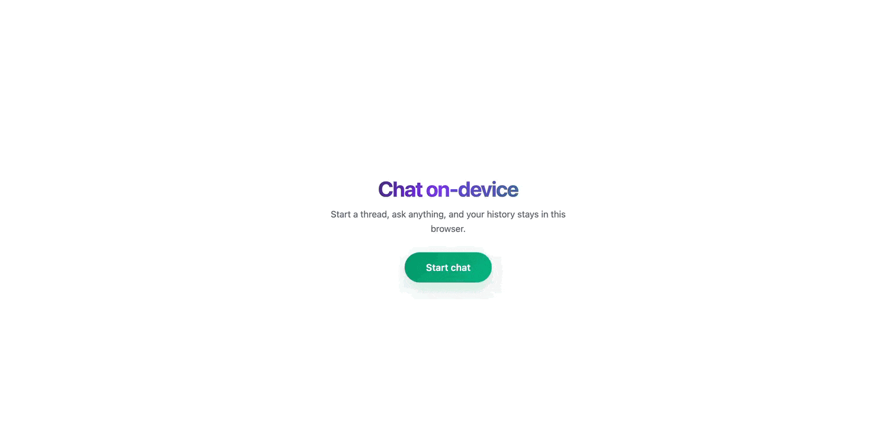

<p align="center">
  
</p>

<h1 align="center">BitNet-Stack</h1>

[](https://opensource.org/licenses/MIT)

Run a small BitNet model on local machine with one Docker command, and chat in browser.

## Features

- Build and start the LLM server with a single command.
- Web interface to chat with the LLM. Start conversation and put follow-up prompts.
- Chat history is stored in browser storage. You get all the chats even if you reload the page or comes back later. It stays in storage unless it is cleared manually.
- A single button to clear all the chats from browser storage.
- LLM remebers the context so you can make follow-up questions it will answer efficiently.
- Responses are streamed from server so you word by word written on page from LLM.
- Runs on any machine with a single docker command.

## Working example



Checkout the [documentation](https://opensource.stackblogger.com/BitNet-Stack/) for more working examples.

## Prerequisites

- [Docker](https://docs.docker.com/get-docker/) (with Docker Compose)

## Quick start

### 1. Clone the repository

```bash
git clone https://github.com/stackblogger/BitNet-Stack.git
cd BitNet-Stack
```

### 2. Start the server

```bash
docker compose up --build -d
```

This builds the **LLM** image and starts one container. The model is downloaded during the image build (first time can take a while).

### 3. Open the chat UI

In your browser go to:

**http://localhost:5001**

(Port **5001** is mapped to the app inside the container on **5000**; change it in `docker-compose.yml` if you need another port.)

## License

This project is licensed under the MIT License. See the [LICENSE](LICENSE) file for details.
